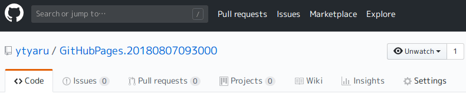
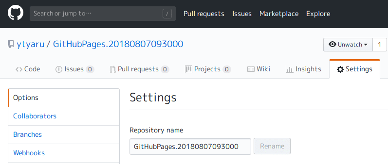
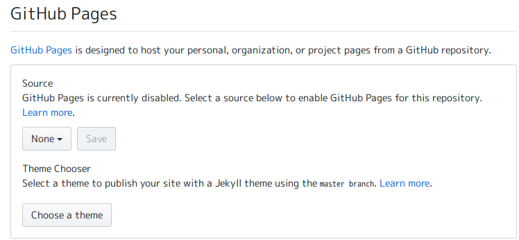
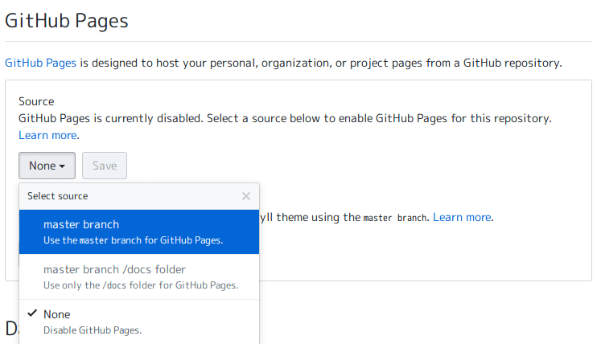
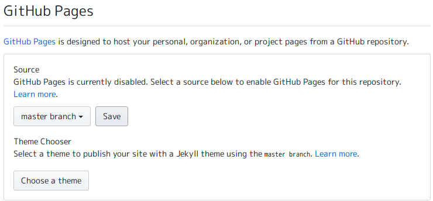
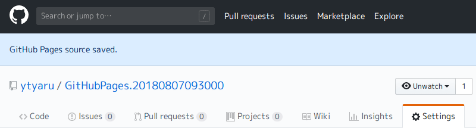
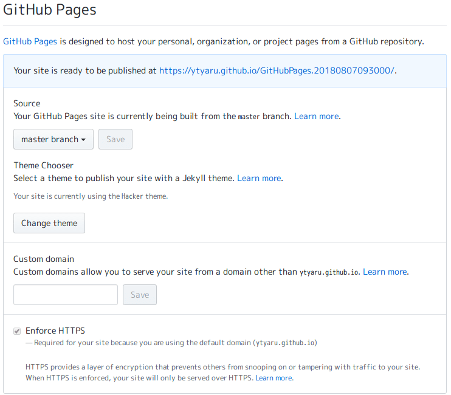
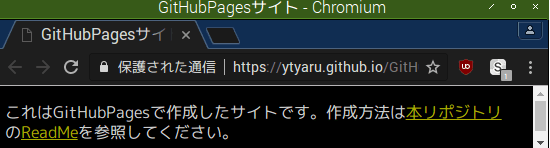

# このソフトウェアについて

GitHubPagesの使い方まとめ。

GitHubでリポジトリごとにWebSiteを構築する方法をまとめる。

作成したサイトは[こちら](https://ytyaru.github.io/GitHubPages.20180807093000)。

# 前提

* GitHubのアカウントを作成する

# 方法

1. サイト用ファイルを作成
1. 1をGitHubへpushする（`git add`, `git commit`, `git push`）
1. サイト公開設定する（GitHubのリポジトリページで`Settings`参照）
1. 確認（URL参照すると公開されていることが確認できる）

## 手順

### 1. サイト用ファイルを作成

* RootRepo/
    * LICENSE.txt
    * ReadMe.md
    * index.html

ディレクトリ名は任意。リポジトリ名やURLのサブディレクトリ名になる。

ファイル詳細は[github](https://ytyaru0.github.io/GitHubPages.Test.20180807080000)参照。

### 2. GitHubへpushする

RootRepoディレクトリを任意GitHubユーザのリポジトリとしてpushする。

1. コンソールを起動する
1. 以下のコマンドを実行する

```
$ cd RootRepo
$ git init
$ git add .
$ git commit "first commit."
$ git push
```

`git`コマンドがないならGitHubサイト内でファイル作成する。

### 3. サイト公開設定する

#### 3-1. リポジトリ設定ページへ遷移する

1. ブラウザを起動する
1. GitHubのサイトへアクセスする
1. pushしたアカウントでログインする
1. pushしたリポジトリのページへ遷移する  
  
1. リポジトリページで`Settings`をクリックする  
  

#### 3-2. リポジトリ設定する

1. `GitHubPages`の項目で`None`になっているリストボタンをクリックする  
  
1. `master branch`, `master branch /doc folder`, `None`の3つの項目が表示されることを確認する
1. `master branch`をクリックする  
  
1. 隣にある`Save`ボタンをクリックする  
  
1. `GitHub Pages source saved.`と表示されることを確認する  
  
1. 再びSettingsページ内のGitHub Pagesの項へスクロールする
1. サイトURLが表示されていることを確認する `https://...`
  

### 4. 確認

1. 表示されたURLをクリックする
1. サイトが表示される

  

表示されないなら数秒待ってからクリックするか、キャッシュ削除してからクリックする。

# 開発環境

* [Raspberry Pi](https://ja.wikipedia.org/wiki/Raspberry_Pi) 3 Model B
    * [Raspbian](https://www.raspberrypi.org/downloads/raspbian/) GNU/Linux 8.0 (jessie)
        * ブラウザ
            * Chromium
                * バージョン 56.0.2924.84 Built on Ubuntu 14.04, running on Raspbian 8.0

# ライセンス

このソフトウェアはCC0ライセンスである。

[](http://creativecommons.org/publicdomain/zero/1.0/deed.ja)

